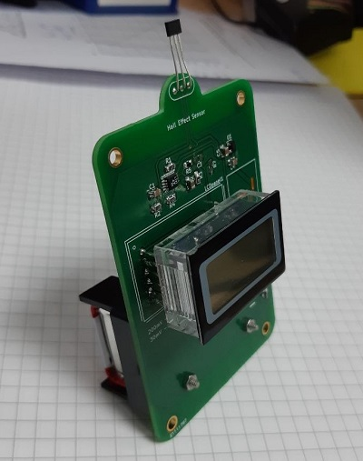

# Hall Effect Sensor

This device is a purely electrical design of a Hall Effect Sensor that measures the magnitude of the magnetic field and displays it on a voltmeter display. 

## Installation

The PCB design files are made in KiCAD which is an open source program and can be downloaded on [their website](http://www.kicad-pcb.org/). 

## Components

The PCB design rules are made to comply with the requirements by [Eurocircuits](https://www.eurocircuits.com/standard-pool-your-default-choice-for-your-pcb/).

 - Hall effect sensor (SS496A1)
 - LCD display (SP200)
 - Differential Amplifier (LTC2053CMS8#PBF)
 - LDO Voltage Regulator (MCP1703AT-5002E/CB)
 - S1P1 Switch
 - 9V Battery and Battery Holder
 
## Contributing

Pull requests are welcome.

## License
[MIT](https://choosealicense.com/licenses/mit/)
